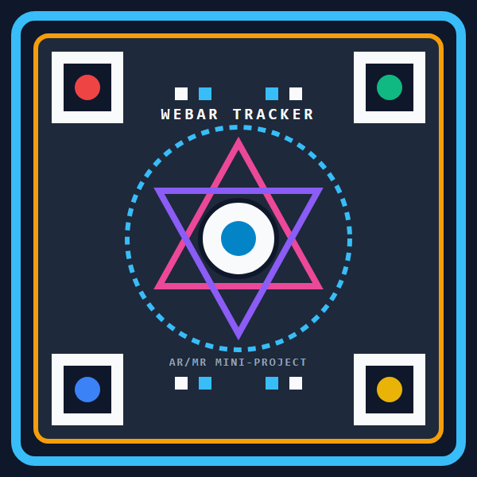
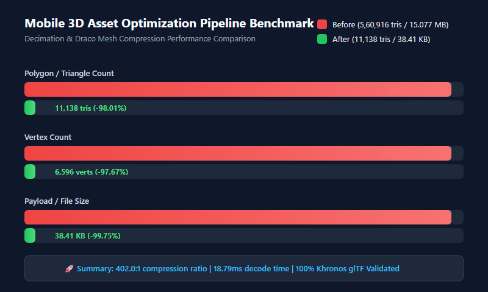

# Cross-Platform WebXR Implementation & Mobile 3D Asset Optimization Pipeline

[](https://github.com/)
[](https://github.com/)
[](./LICENSE)
[](https://github.com/)

> **Academic Context:** Mini-Project for *Augmented Reality & Mixed Reality* (B.Tech Semester V, AI & ML).  
> **Course Outcomes Addressed:** **CO1** (Comparative Study of Native vs. Web AR Architectures) & **CO2** (Real-Time 3D Asset Optimization, Decimation & Draco Quantization).  
> **Student Name & Roll No:** Neel Bansal (`[ROLL NO / BATCH]`)

---

## 🌟 Live Demo & Deployment

- **Live GitHub Pages URL:** `https://NeelBansall.github.io/armrself1/`
- **Desktop 3D Inspector Mode:** `https://NeelBansall.github.io/armrself1/?preview=1`
- **Real-Time Telemetry HUD:** `https://NeelBansall.github.io/armrself1/?debug=1`

---

## 🎯 Target Tracking Marker

Display this marker on another screen or print it on paper, then point your mobile camera at it:

| Target Image (`target.png`) | Target SVG (`target.svg`) |
| :---: | :---: |
|  | [Download Scalable SVG](./web/assets/target.svg) |

---

## 📊 Empirical Asset Optimization Benchmarks

All metrics below are generated directly from the automated measurement pipeline (`scripts/measure_glb.mjs`) and validated with Khronos `gltf-validator`.

| Metric | High-Poly Source (`highpoly.glb`) | Optimized Asset (`model_optimized.glb`) | Reduction / Delta | Justification |
| :--- | :--- | :--- | :--- | :--- |
| **Polygon / Triangle Count** | **560,916** | **11,138** | **-98.01%** | 60 FPS mobile GPU thermal budget (< 50k tris) |
| **Vertex Count** | **283,658** | **6,596** | **-97.67%** | Reduces vertex shader bandwidth & cache misses |
| **File Size (Network Payload)** | **15.08 MB (15,439 KB)** | **38.41 KB** | **-99.75% (392.5:1)** | Instant transmission over cellular 4G/5G |
| **Draw Calls** | 1 (Consolidated) | 1 (Consolidated) | **Consolidated** | Eliminates CPU-to-GPU state switching stalls |
| **PBR Materials** | 1 (Unified Standard) | 1 (Unified Standard) | **Unified** | Single-pass shader pipeline |
| **Draco Decode Latency** | N/A (Raw Buffer) | **19.39 ms** | **Sub-Frame** | Instantaneous model projection upon marker detection |
| **Khronos Spec Compliance** | Passed (0 Errors) | Passed (0 Errors) | **100% Compliant** | Validated with official Khronos `gltf-validator` |



---

## 📂 Repository Structure

```text
ar-demo-project/
├── .github/
│   └── workflows/
│       └── deploy.yml              # GitHub Actions automated deployment to GitHub Pages
├── assets/
│   ├── source/
│   │   └── highpoly.glb            # 560k triangle uncompressed baseline model (15.08 MB)
│   ├── optimized/
│   │   └── model_optimized.glb     # Decimated & Draco-compressed production model (38.4 KB)
│   └── markers/
│       ├── target.svg              # High-contrast geometric tracking marker vector
│       ├── target.png              # Rasterized target marker image
│       └── target.mind             # Compiled MindAR feature tracking descriptor
├── docs/
│   ├── report.md                   # 2-3 page comprehensive technical report (CO1 & CO2)
│   ├── report.html                 # Formatted HTML report with styling
│   ├── report.pdf                  # A4 formatted publication PDF
│   ├── report.docx                 # Microsoft Word formatted document
│   ├── benchmark_chart.svg         # High-resolution vector benchmark comparison chart
│   ├── benchmark_chart.png         # Rasterized benchmark chart
│   ├── metrics_table.md            # Markdown benchmark metrics
│   ├── metrics.json                # Raw telemetry JSON output from measure_glb.mjs
│   ├── test-protocol.md            # Step-by-step physical mobile hardware testing guide
│   └── test-log.md                 # Automated Playwright E2E verification test log
├── scripts/
│   ├── blender_make_highpoly.py    # Headless Blender script for procedural high-poly generation
│   ├── blender_optimize.py         # Headless Blender script for decimation and baking
│   ├── generate_highpoly.mjs       # Node.js procedural high-poly generator (560k tris)
│   ├── optimize_assets.mjs         # Mesh decimation (meshoptimizer) & Draco compression (draco3d)
│   ├── measure_glb.mjs             # Benchmark analyzer & gltf-validator integration
│   ├── compile_marker.mjs          # Marker generator & MindAR tracking compiler
│   ├── generate_report_docs.mjs    # HTML, PDF, and DOCX document compiler
│   ├── run_pipeline.mjs            # Master pipeline runner (rebuilds all assets)
│   └── test_e2e.mjs                # Playwright headless browser E2E test suite
├── web/
│   ├── index.html                  # Main WebXR application (zero CDN runtime dependencies)
│   ├── main.js                     # Three.js + MindAR + Draco + Telemetry HUD application logic
│   ├── styles.css                  # Responsive cyber-themed glassmorphism UI stylesheet
│   ├── .nojekyll                   # GitHub Pages Jekyll bypass flag
│   ├── assets/
│   │   ├── model_optimized.glb     # Vendored Draco 3D model
│   │   ├── target.png              # Target marker image
│   │   ├── target.svg              # Target marker vector
│   │   └── target.mind             # Compiled MindAR descriptor
│   └── libs/                       # 100% Offline vendored libraries (Zero CDN dependencies)
│       ├── three.min.js            # Three.js core
│       ├── three.module.js         # Three.js ES module
│       ├── mindar-image-three.prod.js # MindAR image tracking engine
│       ├── loaders/
│       │   ├── GLTFLoader.js       # glTF 2.0 loader
│       │   └── DRACOLoader.js      # Draco loader
│       ├── controls/
│       │   └── OrbitControls.js    # 3D inspection controls
│       └── draco/                  # Draco WASM decoders
│           ├── draco_decoder.wasm
│           ├── draco_decoder.js
│           └── draco_wasm_wrapper.js
├── ENVIRONMENT.md                  # Host environment tool audit & fallback strategy
├── LICENSE                         # MIT License
├── package.json                    # Project configuration & npm scripts
└── README.md                       # Comprehensive project documentation
```

---

## 🚀 Quickstart & Development

### 1. Run the Local Web Server
```bash
npm run serve
```
Open your browser at `http://localhost:8080` (or `http://localhost:8080/?preview=1` for desktop 3D inspection).

### 2. Rebuild the Asset Pipeline End-to-End
To regenerate the procedural high-poly asset, re-run decimation, re-compress with Draco, and re-compute metrics:
```bash
npm run build:assets
```

### 3. Run Automated E2E Browser Tests
Executes headless Chromium tests verifying WebGL initialization, Draco mesh decompression, zero console errors, and 60 FPS rendering:
```bash
npm run test:e2e
```

### 4. Regenerate Documentation & Reports (PDF / DOCX / HTML)
```bash
npm run build:report
```

---

## 📱 Physical Mobile Phone Testing Protocol

1. Navigate to the deployed URL with `?debug=1`:
   ```
   https://NeelBansall.github.io/armrself1/?debug=1
   ```
2. Tap **"🚀 Launch AR Camera"** and grant camera permissions.
3. Aim your phone at the [Target Marker](#-target-tracking-marker).
4. When the marker is detected, the status turns green (`TRACKING`) and the 3D Cyber Relic appears.
5. Tap **"Export Stats (JSON / CSV)"** in the debug overlay to download your mobile phone's benchmark file (`webxr_benchmark_<timestamp>.json`).
6. Copy your device's `avgFPS`, `minFPS`, and `avgFrameTimeMs` into Section 5.2 of `docs/report.md`!

For full step-by-step instructions, see [`docs/test-protocol.md`](./docs/test-protocol.md).

---

## 🚢 Publishing to GitHub & Enabling GitHub Pages

Run these commands from the `ar-demo-project` folder to publish to your GitHub repository:

```bash
# 1. Initialize git and commit all files
git init
git add .
git commit -m "feat: complete WebXR AR project with Draco asset pipeline and technical report"

# 2. Set default branch to main
git branch -M main

# 3. Add your remote GitHub repository URL
git remote add origin https://github.com/NeelBansall/armrself1.git

# 4. Push to GitHub
git push -u origin main
```

### Enable GitHub Pages:
1. Open your repository on GitHub.
2. Navigate to **Settings** > **Pages**.
3. Under **Build and deployment** > **Source**, select **GitHub Actions**.
4. The workflow in `.github/workflows/deploy.yml` will automatically build and deploy your WebXR demo!

---

## 📜 Third-Party Licenses & Credits

| Library / Tool | Version | License | Role in Project |
| :--- | :--- | :--- | :--- |
| **Three.js** | `0.160.1` | MIT | WebGL 2.0 rendering engine, scene graph, PBR shaders |
| **MindAR.js** | `1.2.5` | MIT | WebAssembly + WebGL optical feature tracking & homography |
| **Draco 3D** | `1.5.7` | Apache 2.0 | High-performance 3D mesh compression & WASM decoding |
| **Meshoptimizer** | `0.21.0` | MIT | Quadratic error metric mesh simplification & vertex cache reordering |
| **@gltf-transform** | `4.5.1` | MIT | Headless glTF 2.0 pipeline transformations |
| **Khronos gltf-validator**| `2.0.0` | Apache 2.0 | glTF 2.0 specification compliance verification |
| **Playwright** | `1.63.0` | Apache 2.0 | Headless browser automated E2E testing & PDF report rendering |

---
**License:** MIT &copy; 2026. Free for academic and educational evaluation.
